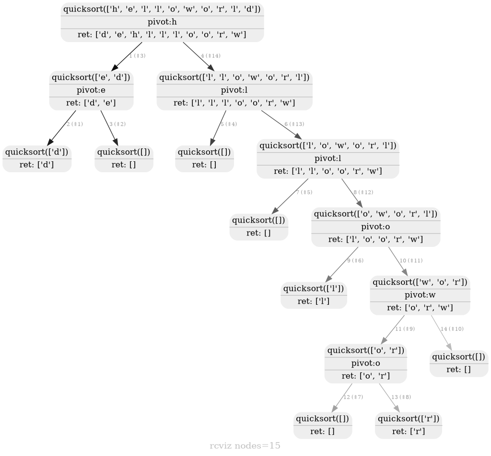

rcviz
=======

* Python module to visualize a recursion as a tree with arguments and return values at each node. 
* Provides a decorator to instrument target functions (as opposed to trace or debugger based approaches)  
* Uses pygraphviz to render the graph. 

## Updates

* Jun-2023:  Jupyter notebook integration. Invoke callgraph.render() with no params from inside a notebook and it renders the visualization as a png in your notebook. See [fibonacci.ipynb](https://github.com/carlsborg/rcviz/blob/master/examples/fibonacci.ipynb) in the examples folder.

* Oct-2021: Run this in your browser! You can run rcviz-annotated python code in your browser, with this [incredible pyiodide based web app](https://www.recursionvisualizer.com/) by [@pamelafox](https://github.com/pamelafox/recursive-visualizations), and generate the same recursion visualizations that you would with the command line.

## Usage

1. Use the @viz decorator to instrument the recursive function.
> @viz <br>
> def factorial(n):

2. Call the function
> factorial(8)

3. Render the recursion with 
> callgraph.render("outfile.png") 

The output file type is derived from the file name. Supported types include .dot (graphviz dot file), .png (png image), .svg (vector graphic). No params writes to out.svg


## Example

Output for recursive Fibonacci function and for a Recursive Descent parse can be found in the ./examples folder and on this [blog post](https://zvzzt.wordpress.com/2014/05/03/python-recursion-visualization-with-rcviz) and 


```python
from rcviz import callgraph, viz

@viz
def quicksort(items):
    if len(items) <= 1: 
        return items
    else:
        pivot = items[0]
        lesser = quicksort([x for x in items[1:] if x < pivot])
        greater = quicksort([x for x in items[1:] if x >= pivot])
        return lesser + [pivot] + greater

print quicksort( list("helloworld") )
callgraph.render("sort.png")
```

## Output 


Note:
1. The edges are numbered by the order in which they were traversed by the execution.
2. The edges are colored from black to grey to indicate order of traversal : black edges first, grey edges last.

## Auxiliary node data

Show intermediate values of local variables in the output render by invoking decoratedfunction.track(param1=val1, param2=val2,...). In the quicksort example above you can track the pivot with:

```python
	pivot = items[0]
	quicksort.track(the_pivot=pivot) # shows a new row labelled the_pivot in each node 
```

## Installation

rviz depends on pygraphviz which is a python api into graphviz. See install instructions for your platform [here](https://pygraphviz.github.io/documentation/stable/install.html). Basically you need to install graphviz using your OS package manager, or  download it from [here](https://graphviz.org/download/) and also the graphviz-dev (ubuntu) or graphviz-devel (fedora) package

#### Linux - Fedora 

> sudo dnf install graphviz graphviz-devel

You can test the graphviz install with:

> $echo 'digraph { a -> b }' | dot -Tsvg > output.svg

> $pip install pygraphviz --user

#### Linux - install troubleshooting

Note: if the install fails, pygraphviz is trying to build a library, first install 

> $sudo dnf install python-devel python-wheel
> $sudo groupinstall "Development Tools"

And now pip install pygraphviz runs cleanly, and therefore also pip install rcviz

> $pip install pygraphviz --user

