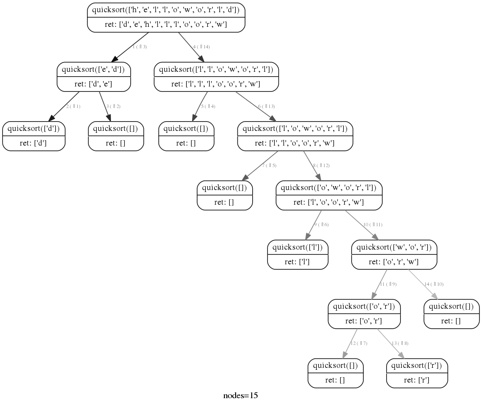

rcviz
=======

* Python module to visualize a recursion as a tree with arguments and return values at each node. 
* Provides a decorator to instrument target functions (as opposed to trace or debugger based approaches)  
* Uses pygraphviz to render the graph. 

##usage

1. Use the @viz decorator to instrument the recursive function.
> @viz <br>
> def factorial(n):

2. Render the recursion with 
> callgraph.render("outfile.png") 

The output file type is derived from the file name. Supported types include .dot (graphviz dot file), .png (png image), .svg (vector graphic)

##example

```python
from rcviz import callgraph, viz

@viz
def quicksort(items):
    if len(items) <= 1: 
        return items
    else:
        pivot = items[0]
        lesser = quicksort([x for x in items[1:] if x < pivot])
        greater = quicksort([x for x in items[1:] if x >= pivot])
        return lesser + [pivot] + greater

print quicksort( list("helloworld") )
callgraph.render("sort.png")
```

## output 


Note:
1. The edges are numbered by the order in which they were traversed by the execution.
2. The edges are colored from black to grey to indicate order of traversal : black edges first, grey edges last.

*Experimental*

Show intermediate values of local variables in the output render by invoking decoratedfunction.track(param1=val1, param2=val2,...). In the quicksort example above you can track the pivot with:

```python
	pivot = items[0]
	quicksort.track(the_pivot=pivot) # shows a new row labelled the_pivot in each node 
```

## dependencies

This requires the native graphviz and libgraphviz-dev packages pre-installed. e.g. On ubuntu do: 

> $sudo apt-get install graphviz libgraphviz-dev<br>

then

For python2:

> python -m virtualenv .venv
> source .venv/bin/activate
> python setup.py install <br>

For python3.x:
> python -m venv .venv
> source .venv/bin/activate
> python setup.py install <br>

Tested on python 2.7.3 and python 3.6 

Setup script by [adampetrovic](https://github.com/adampetrovic).

